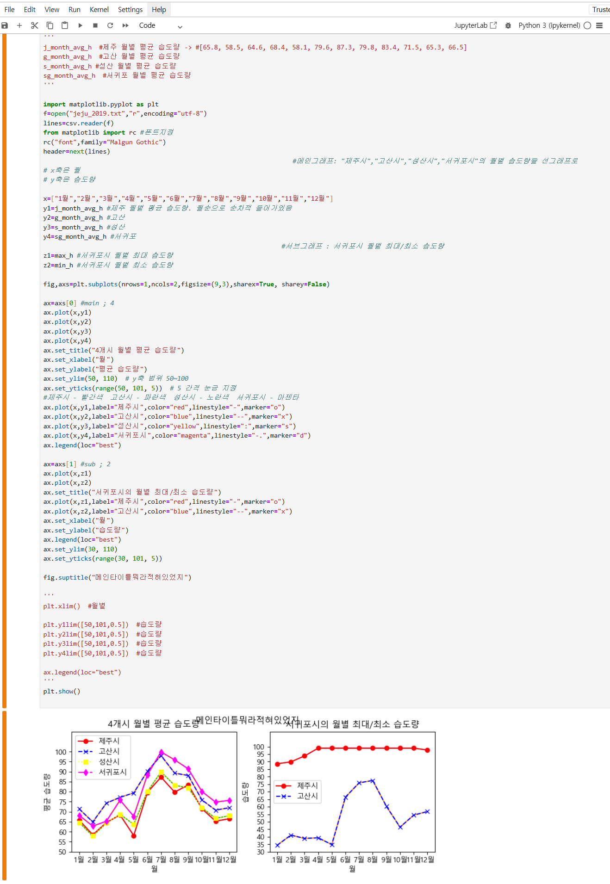

# 포트폴리오

## ✉️
* Email : beautiyj@naver.com
* [Youtube](https://www.youtube.com/)
* [Naver blog](https://section.blog.naver.com/BlogHome.naver?directoryNo=0&currentPage=1&groupId=0)
* [instagram](https://www.instagram.com)
* [X(twitter)](https://x.com)
  
## 🐾
* 새싹캠퍼스 용산
	+ 비트컴퓨터_AIoT 과정
	+ Python, Kotlin, Github, Django etc

  

## 실습 (250728)
### > [Github] helloworld 레파지토리와 링크 연결하기 <
[링크](https://beautiyj.github.io/helloworld)

   

## 실습 (25nnnn)
### > [데이터 시각화] 주피터 노트북 & 파이썬 예제 <

   

## 실습 (25nnnn)
### > [데이터 시각화] 주피터 노트북 & 파이썬 예제 <
[실습](/4조김윤정_실습12제출용.ipynb)

   

## 미니 프로젝트
### [미니 프로젝트] 기간 n/n~n/n
#### 1. 개발 인원과 포지션
+ 총 n명 (기획/3D 그래픽/프론트엔드/프로그래머 n명)
#### 2. 개발 환경
+ 언어 :
+ OS :
#### 3. 사용기술 및 툴
+ 
#### 4. 설명
+ 미니프로젝트 설계 및 개발
+ 
+
***

   

## 팀 프로젝트
### [팀 프로젝트] 기간 n/n~n/n
#### 1. 개발 인원과 포지션
+ 총 n명 (프로그래머 n명)
#### 2. 개발 환경
+ 언어 :
+ OS :
#### 3. 사용기술 및 툴
+ 
#### 4. 설명
+ 미니프로젝트 설계 및 개발
+ 
+
***

